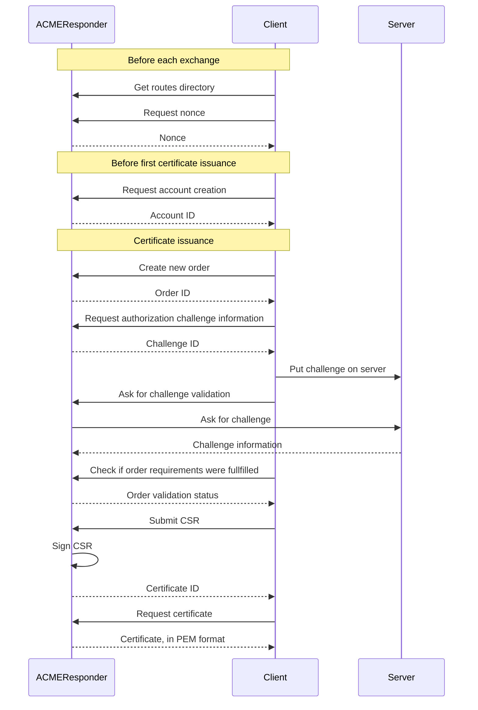

# Certificate issuance diagram

Here is a schema that present the ACME protocol flow:

```mermaid
sequenceDiagram
    Note over ACMEResponder, Client: Before each exchange
    Client->>ACMEResponder: Get routes directory
    Client->>ACMEResponder: Request nonce
    ACMEResponder-->>Client: Nonce

    Note over Client,ACMEResponder: Before first certificate issuance
    Client->>ACMEResponder: Request account creation
    ACMEResponder-->>Client: Account ID

    Note over Client,ACMEResponder: Certificate issuance
    Client->>ACMEResponder: Create new order
    ACMEResponder-->>Client: Order ID

    Client->>ACMEResponder: Request authorization challenge information
    ACMEResponder-->>Client: Challenge ID

    Client->>Server: Put challenge on server

    Client->>ACMEResponder: Ask for challenge validation
    ACMEResponder->>Server: Ask for challenge
    Server -->> ACMEResponder: Challenge information

    Client->>ACMEResponder: Check if order requirements were fullfilled
    ACMEResponder-->>Client: Order validation status

    Client->>ACMEResponder: Submit CSR
    ACMEResponder->>ACMEResponder: Sign CSR
    ACMEResponder-->>Client: Certificate ID

    Client->>ACMEResponder: Request certificate
    ACMEResponder-->>Client: Certificate, in PEM format

```