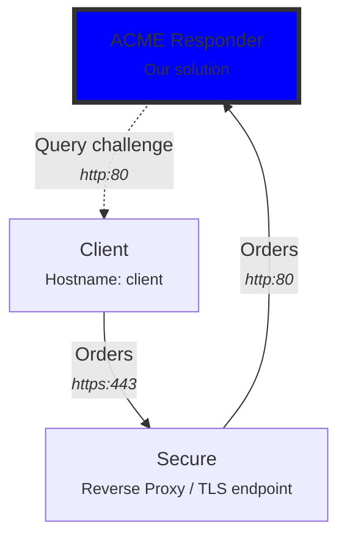

# Evaluation
This project was achieved during a "Python for Security" course at EPITA.

In order to validate the course, the teacher asked us to give him some guidelines to allow him to easily and quickly try out the solution built. Here are presented those instructions.

## Environment
In order to assess our ACME responder, we decided to use the most popular ACME client, `certbot`. ([official website](https://certbot.eff.org/)).

Unfortunately, Certbot is certainly the most rigorous ACME client, as the contrary of sewer (used in unit testing, which is more permissive). Certbot expect from the ACME provider a strict compliance to the standards. One of these requirements is that an ACME server shall not be queried in HTTP. 

Therefore, we had to set up a local environment where ACME responder could be reached in HTTPS. In order to achieve this goal, we needed to create a self-signed authority that would sign a certificate used for a TLS reverse proxy.

We built such environment using Docker Compose :



In this environment, the client (hostname `client`) can query the ACMEResponder on the URL https://secure/ (hostname `server`), which is a reverse proxy that includes a TLS endpoint.

:::info
The certificate of the reverse proxy is signed by a self-signed Certification Authority, so the client must either accept all certificates or add the self-signed Certification Authority to its trusted certificates store. We opted for the latter solution.
:::

:::danger
For the sake of simplicity, we hardcoded some certificates and private keys in the `evaluation` directory. Because these keys are publicly available, they MUST NEVER be used in production!
:::

The reverse proxy redirect traffic to the `acme` container, which runs our solution. This machine can directly query the client for the authentication challenges during certificates issuance.


## Get the source code
In order to get started, you must first clone the repository:

```bash
git clone https://github.com/pierre42100/ACMEresponder
```

Then you must enter inside the `evaluation` directory:

```bash
cd ACMEresponder/evaluation
```

## Prepare the storage
First, you need to initialize the Certification Authority that will be used to sign issued certificates :

```bash
# Create storage directory
mkdir storage

# Create a CA private key
openssl genrsa -out storage/ca-privkey.pem 4096

# Create a CA signing key
openssl req -new -key storage/ca-privkey.pem -x509 -days 1000 -out storage/ca-pubkey.pem -subj "/C=FR/ST=Loire/L=StEtienne/O=Global Security/OU=IT Department/CN=example.com"
```


## Execute the solution
In order to run the solution, you must have `docker` and `docker-compose` installed on your computer.

Deploy the `docker-compose` network (still from the `evaluation` directory):

```bash
docker-compose up
```

Three Docker images will be pulled from the Docker Hub, including our solution, in production mode.


## Test certificates issuance
In order to test certificates issuance, open a new shell (leave the window with `docker-compose` open) and open a new shell on the `client` container:

```bash
docker exec -it evaluation-client-1 /bin/bash
```

:::info
If the previous command does not work, use the command `docker ps` to get the name of the container running our client (`pierre42100/acme-eval-client`):

```bash
docker ps | grep pierre42100/acme-eval-client
```

Depending on your version of `docker-compose` the following command could work instead:

```bash
docker exec -it evaluation_client_1 /bin/bash
```
:::

In the container, you can request a new certificate issuance:

```bash
REQUESTS_CA_BUNDLE=/myca.crt certbot certonly -n  --webroot -w /storage -d client --server https://secure/directory --agree-tos --email mymail@corp.com
```

If everything goes well, you should get an output similar to that one:

```
Saving debug log to /var/log/letsencrypt/letsencrypt.log
Account registered.
Requesting a certificate for client

Successfully received certificate.
Certificate is saved at: /etc/letsencrypt/live/client/fullchain.pem
Key is saved at:         /etc/letsencrypt/live/client/privkey.pem
This certificate expires on 2023-05-07.
These files will be updated when the certificate renews.

NEXT STEPS:
- The certificate will need to be renewed before it expires. Certbot can automatically renew the certificate in the background, but you may need to take steps to enable that functionality. See https://certbot.org/renewal-setup for instructions.

- - - - - - - - - - - - - - - - - - - - - - - - - - - - - - - - - - - - - - - -
If you like Certbot, please consider supporting our work by:
 * Donating to ISRG / Let's Encrypt:   https://letsencrypt.org/donate
 * Donating to EFF:                    https://eff.org/donate-le
- - - - - - - - - - - - - - - - - - - - - - - - - - - - - - - - - - - - - - - -
```

:::tip
You can use Wireshark to capture and check the exchange between Certbot and ACMEResponder
:::

## Check issued certificate
You can then inspect the details of the generated certificate (still within `client` Docker container):

```bash
openssl x509 -in /etc/letsencrypt/live/client/fullchain.pem -text -noout
```


:::note

In our case, the common name will be `client` (the name of the container in the `docker-compose` network)

:::

:::info
And that's it! You just generated a certificate from your very own ACME provider!!!
:::

## Manually build Docker images
By default, the given directions will pull the images from the Docker hub. However, you can also build by yourself the Docker images used in this demonstration :

```bash
cd /root/of/repo

# Build main image (ACME Responder)
bash build-docker-image.sh

# Build reverse proxy image
cd evaluation/reverse-proxy
bash build-docker-image.sh

# Build client image
cd evaluation/test-client
bash build-docker-image.sh
```