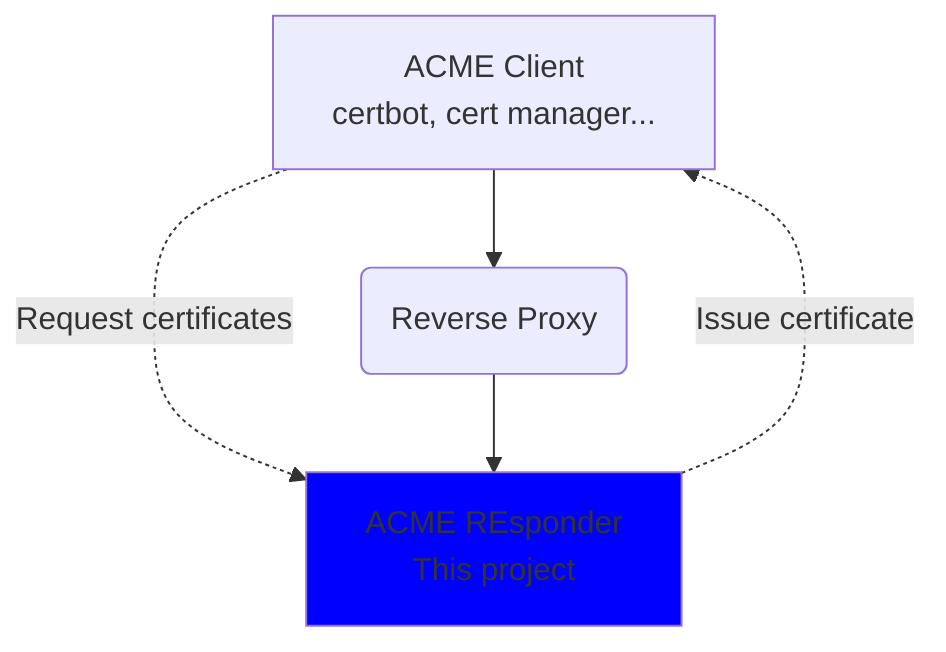

# Discover ACMEResponder
ACMEresponder is a free and Open Source automated certification authority service. 

You can use it to issue certificates securely from your internal certification authority.

## The contributors
* Pierre HUBERT
* Yanis MAMMAR
* Ziyed MELIZI
* Arthur HOCHE

## Limitations
* Only HTTP-based challenge are supported
* Account management is limited to accounts creation (no key rotation)
* The revocation of the certificates is not supported
